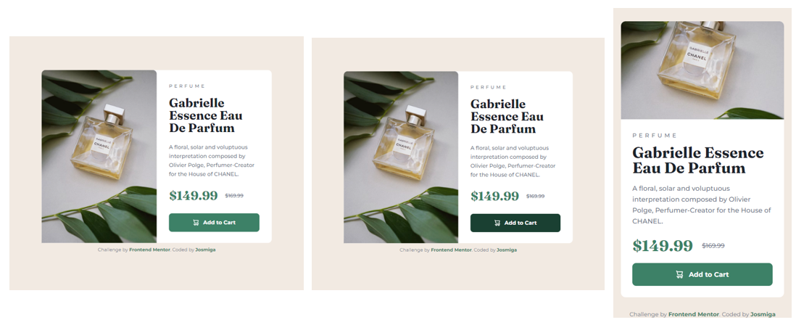

# Frontend Mentor - Product preview card component

This is a solution to the [Product preview card component challenge on Frontend Mentor](https://www.frontendmentor.io/challenges/product-preview-card-component-GO7UmttRfa). Frontend Mentor challenges help you improve your coding skills by building realistic projects. 

## Overview
### Screenshot

### Links
- Github Site URL: [Josmiga - Product preview card component](https://josmiga.github.io/product-preview-card-component-main/)

## My process
### Built with
- Semantic HTML5 markup
- CSS custom properties
- Flexbox

## Author
- Frontend Mentor - [@Josmiga](https://www.frontendmentor.io/profile/Josmiga)
- Twitter - [@josmigga](https://www.twitter.com/josmigga)